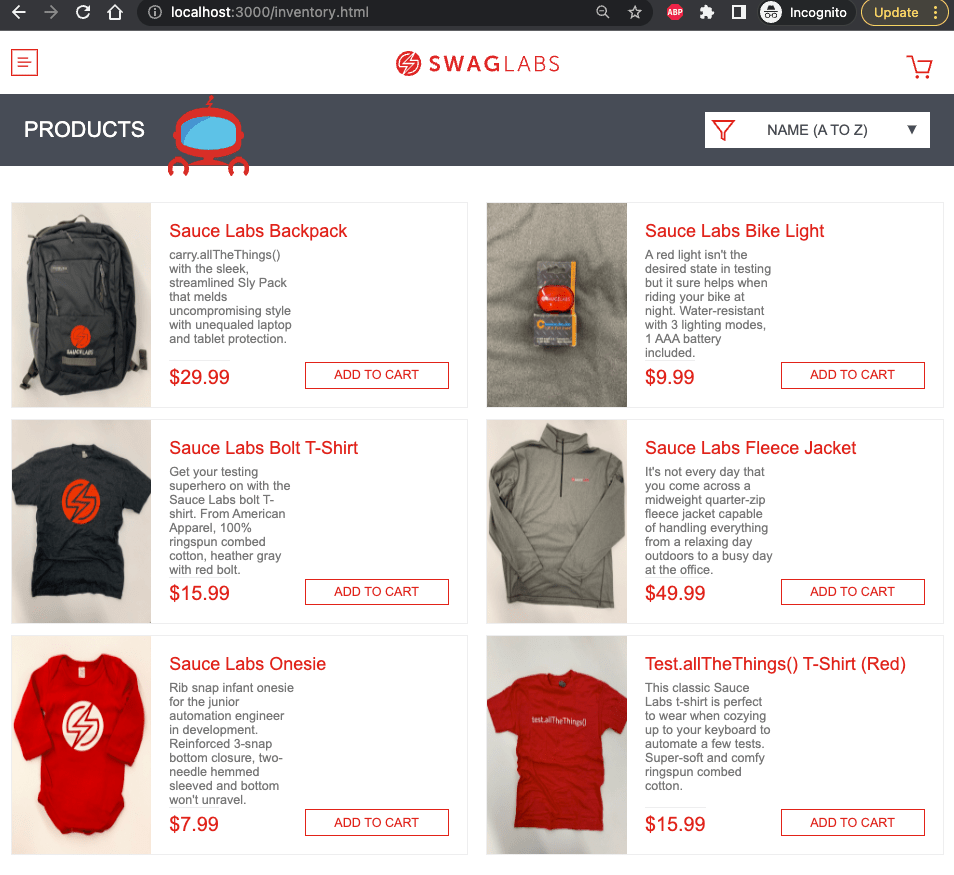

# taste-the-sauce

> Cypress testing using the SauceLabs sample web app




## Install

Requires Node v16+

```
$ node -v
v16.17.0
$ npm install
```

## Run

To start the application if you are using Node v16 use `npm start` command. 
If you are using Node v17+ use `npm run start-18` command

In both cases, it should print

```
Compiled successfully!

You can now view sample-web-app in the browser.

  Local:            http://localhost:3000
  On Your Network:  http://10.0.0.188:3000

```

Open the browser and point at `localhost:3000`, you should see the login page.

The original web application was forked from [saucelabs/sample-app-web](https://github.com/saucelabs/sample-app-web) repo.

## Scaffold Cypress config file 

1. Locate and open the Cypress Configuration File `cypress.config.js`
   The Cypress configuration file is usually located at the root of your project and is named cypress.config.js. 
   If you can't find it, you may need to initialize Cypress in your project first using terminal command: 

   ```npx cypress open``` 

   and use the UI wizard to create our first spec

2. Add the following configuration to the file:
```
   // cypress.config.js

const { defineConfig } = require('cypress')

module.exports = defineConfig({
  e2e: {
    // baseUrl, etc
    baseUrl: 'http://localhost:3000',
    supportFile: false,
    fixturesFolder: false,
    setupNodeEvents(on, config) {
      // implement node event listeners here
      // and load any plugins that require the Node environment
    },
  }
})
```


